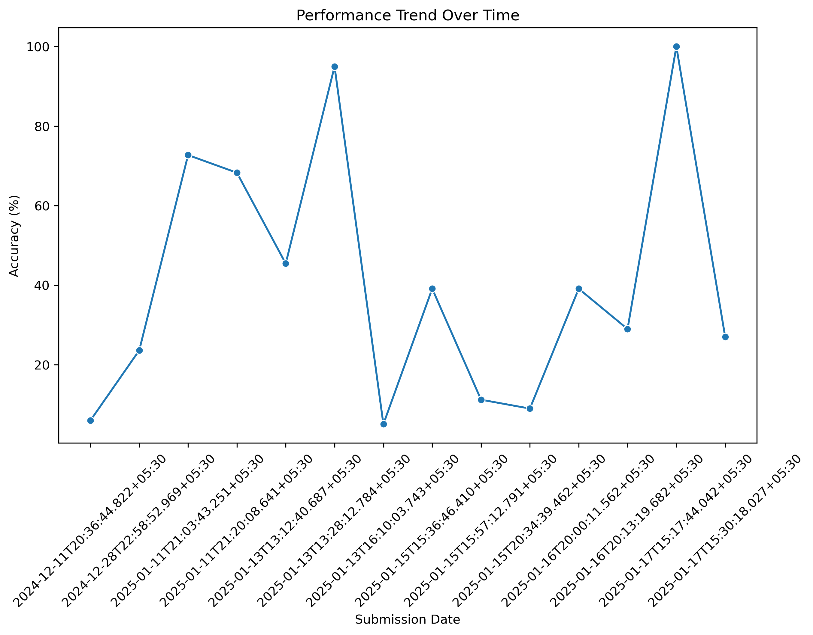
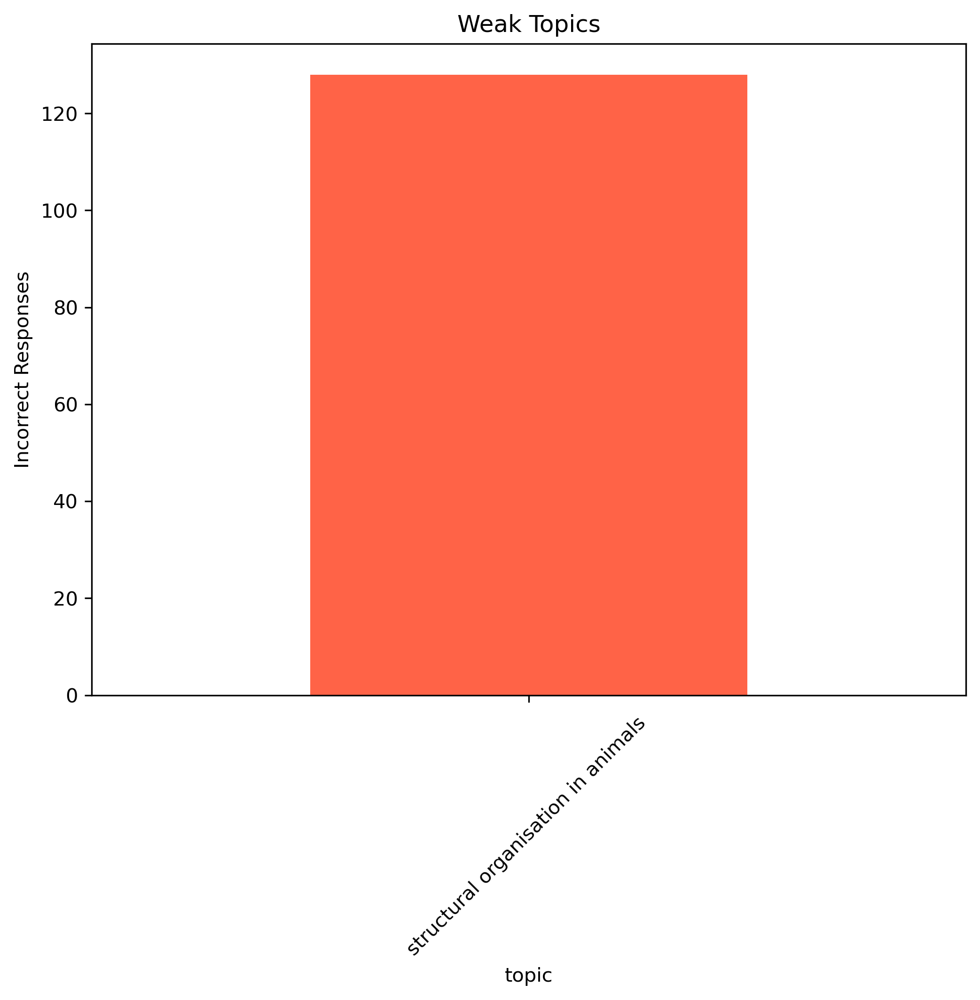

# Personalized-Student-Recommendation
This project analyzes quiz performance data and provides personalized recommendations for students to improve their preparation. The script generates insights into weak topics, performance trends, and difficulty levels.
1. Clone the repository:
   ```bash
   git clone https://github.com/Neha06-tech/Personalized-Student-Recommendation.git
   ```
2. Navigate to the project directory:
   ```bash
   cd Personalized-Student-Recommendation
   ```
3. Install the required Python libraries:
   ```bash
   pip install pandas matplotlib seaborn
   ```
4. Place the dataset files (`LLQT.json`, `rJvd7g.json`, `XgAgFJ.json`) in the project folder.
5. Run the script:
   ```bash
   python main.py
   ```

#### 3. **How It Works (Approach)**
Explain how your script works step by step:
```markdown
## How It Works

1. **Data Loading**:
   - The script loads current quiz data, quiz submission data, and historical quiz data from JSON files.
2. **Data Analysis**:
   - It analyzes quiz performance by topics, difficulty levels, and response accuracy.
3. **Insights Generation**:
   - Highlights weak areas, improvement trends, and performance gaps for a given user.
4. **Recommendations**:
   - Provides actionable steps to improve quiz preparation, such as focusing on weak topics or specific difficulty levels.

## Screenshots

Below are some visualizations generated by the script:

1. **Performance Trend Over Time**  
   

2. **Weak Topics Analysis**  
   "

